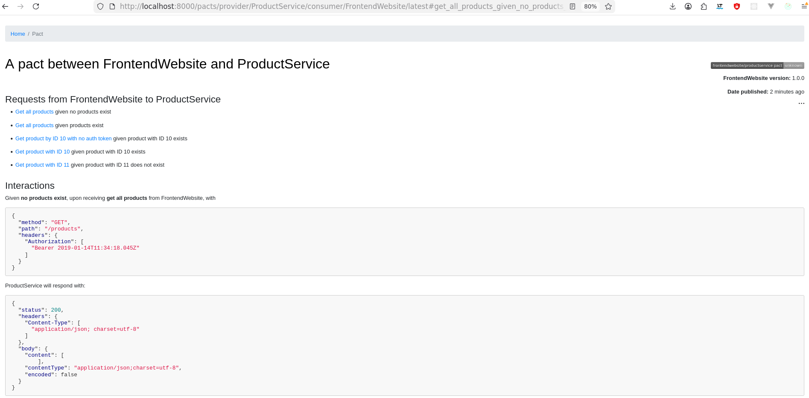

# nodejs-pact-contract-testing

Consumer driven contract testing demo.

## Terminology

- Consumer - client
- Provider - server
- Contract broker - registry for contracts
  - functionality: push/pull contract
  - visible to both consumer and provider

## Shell

```sh
docker pull pactfoundation/pact-broker:2.137.0-pactbroker2.118.0

docker-compose -f ./docker-compose.yaml -p demo1 up --build
docker-compose -p demo1 down

# 8000 - pact broker

npm init -y

# in $PROJECT_ROOT
npm i
# will trigger `postinstall`
```

## Overview

- Pact is consumer driven contract testing.
- Instead of: provider defines API and consumer adapt
- It does: consumer defines what it needs, and provider must satisfy it
- The contract is generated by the consumer.

## Steps / Observations

1. Consumer(Frontend) is the BOSS
    1. `npm run test:unit` - (Standard old fashion way: `api.js` is mocked and tested in `api.spec.js`)
    1. `npm run test:pact` - Mock API test + clean `pact` folder + regenerate consumer contracts
        1. `npm run pact:publish` publish contracts to the broker: `http://127.0.0.1:8000`
1. How published contracts look like:
    1. 
1. Test Provider(Backend) using generated contracts
    1. `npm run test:pact` - will run server app and validate contracts fetched from `http://127.0.0.1:8000`

## References

1. <https://github.com/pact-foundation/pact-workshop-js>
1. <https://stackoverflow.com/a/59718259>
